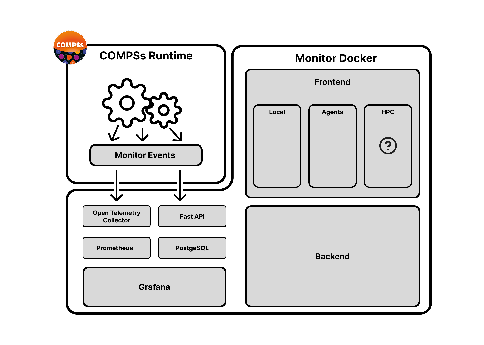

  
   
  

# ⚙️ Real-Time Monitoring for COMPSs Runtime

> **A local web-based monitoring and control interface for COMPSs executions.**  
> This tool allows users to visualize runtime events in real time and interact with COMPSs agents through an intuitive web interface.

---

## 🔍 Overview

**Real-Time Monitoring for COMPSs** is a fully local web application that:
- Displays **runtime events and metrics in real time** using **OpenTelemetry → Prometheus → Grafana**.  
- Provides a **graphical interface** to easily **inspect and manage COMPSs agents** during execution.  
- Enables **dynamic tracing configuration**, allowing users to toggle different tracing types without modifying the runtime code.

This project is designed for researchers and developers working with the **COMPSs runtime** who need a modern, real-time insight into agent activity and task execution.

---

## 🧩 Features

- 📊 **Live event visualization:** monitor metrics and execution data in real time.  
- 🧠 **Agent management:** view and control active agents directly from the browser.  
- ⚡ **Dynamic tracing modes:** switch between tracing types (e.g., standard vs. OpenTelemetry) from a single interface.  
- 🧱 **Integrated local deployment:** everything runs locally — no cloud setup required.  
- 🧰 **Modular architecture:** separate runtime event system, tracing system, and frontend dashboard.

---

## 🧠 Architecture Overview

  

**Architecture summary:**
- **COMPSs Runtime (Java):** generates real-time events and exposes tracing interfaces.  
- **OpenTelemetry Collector:** collects metrics and exports them to Prometheus.  
- **Prometheus:** stores time-series data.  
- **Grafana:** provides rich visual dashboards.  
- **Local WebApp (React + Node.js + SQLite):** user interface for event visualization and agent interaction.  
- **Docker:** used to deploy the complete environment locally.

---

## 🖥️ Application Screenshots

  
  
  

<b>Monitor · Agents · Agent Details</b>

---

## 🛠️ Tech Stack

- **Backend:** Node.js + Express  
- **Frontend:** React + Tailwind CSS  
- **Database:** SQLite  
- **Telemetry:** OpenTelemetry → Prometheus → Grafana  
- **Runtime Integration:** COMPSs (Java) with custom event system  
- **Containerization:** Docker Compose  

---

## 📈 Example Dashboard

  

---

## 🧩 Future Improvements

- Real-time alerting system (custom thresholds).  
- Support for distributed runtime visualizations.  
- Integration with additional monitoring backends (e.g., Loki, Jaeger).  

---

## 👨‍💻 Author

**Roc Cutal**  
Researcher and software engineer at BSC — Workflows and Distributed Comuputing Group.

 [roc.cutal@gmail.com](mailto:roc.cutal@gmail.com)

---

## 🏷️ License

This project is licensed under the **MIT License** — see the [LICENSE](./LICENSE) file for details.
